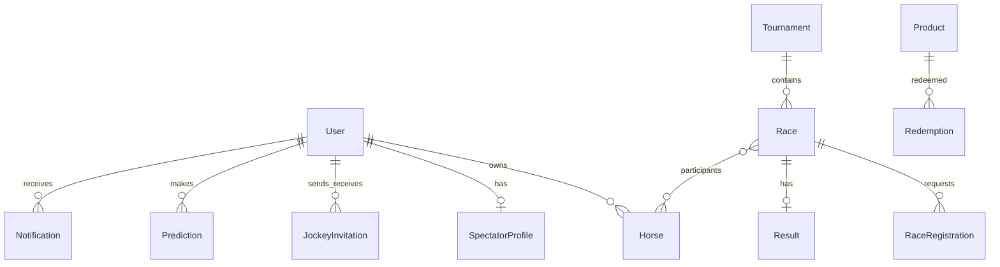

# Database — ODM, schema & đánh giá sơ bộ

## Lựa chọn: **Mongoose (ODM)** + **MongoDB**

| | ORM | ODM |
|---|-----|-----|
| **Là gì** | Object–**Relational** Mapping — ánh xạ class ↔ bảng SQL | Object–**Document** Mapping — ánh xạ class ↔ document JSON (MongoDB) |
| **DB** | PostgreSQL, MySQL, SQL Server… | MongoDB (chính), một số document store khác |
| **Quan hệ** | FK, JOIN, transaction ACID mạnh | `ref`, `populate`, embed sub-document |
| **Schema** | Cứng (migration) | Linh hoạt (Mongoose vẫn ép schema ở app layer) |

### Các lựa chọn khả dĩ cho project này

| Công cụ | Loại | Phù hợp? | Ghi chú |
|---------|------|----------|---------|
| **Mongoose** | ODM | **Đã chọn** | Schema có sẵn trong `database.txt`, hooks (bcrypt, điểm), sub-doc `participants`, TTL notification |
| **Typegoose** | ODM (decorator trên Mongoose) | Có thể | Cú pháp class `@prop()` — thêm phụ thuộc, team đã dùng schema thuần |
| **Prisma** | ORM | Chỉ nếu đổi sang **PostgreSQL/MySQL** | Type-safe, migration đẹp; **không** dùng trực tiếp với Mongo (Prisma Mongo đã deprecated/hạn chế) |
| **TypeORM / Sequelize** | ORM | Không khuyến nghị cho design hiện tại | Phải thiết kế lại quan hệ bảng, mất embed `participants` |
| **MongoDB driver thuần** | Không ORM/ODM | Tránh | Nhiều boilerplate, không có validation/hook sẵn |

**Kết luận:** Với stack **Node + TypeScript + MongoDB** và file thiết kế Mongoose sẵn, **Mongoose là lựa chọn khả thi và đúng nhất**, không cần đổi ORM trừ khi team quyết định chuyển sang SQL.

---

## Cấu trúc code

```
backend/src/
├── config/
│   ├── env.ts           # MONGODB_URI, PORT
│   └── database.ts      # connect / disconnect
├── types/
│   └── shared.types.ts  # enum dùng chung
└── models/
    ├── User.model.ts
    ├── Horse.model.ts
    ├── Track.model.ts
    ├── RaceMeeting.model.ts
    ├── Tournament.model.ts
    ├── Race.model.ts
    ├── RaceRegistration.model.ts
    ├── JockeyInvitation.model.ts
    ├── Result.model.ts
    ├── Prediction.model.ts
    ├── PredictionPool.model.ts
    ├── SpectatorProfile.model.ts
    ├── Product.model.ts
    ├── Redemption.model.ts
    ├── Notification.model.ts
    ├── AuditLog.model.ts
    ├── OrganizerLedger.model.ts
    └── index.ts
```

- **Schema mục tiêu (production):** [DATABASE_EXPECT.md](./DATABASE_EXPECT.md)  
- **Index:** `Horse_race/database.txt`  
- **Code:** `backend/src/models/`

---

## Sơ đồ quan hệ (logic)



---

## Collections (17 — xem DATABASE_EXPECT.md)

| Model | Collection | Vai trò chính |
|-------|------------|----------------|
| User | users | Auth, 5 role |
| Horse | horses | Ngựa của owner |
| Tournament | tournaments | Giải + predictionConfig |
| Race | races | Cuộc đua + participants[] |
| **Track** | tracks | Sân đua |
| **RaceMeeting** | racemeetings | Buổi đua (nhiều race) |
| **RaceRegistration** | raceregistrations | Đơn đăng ký — admin duyệt |
| Result | results | BXH, vi phạm, protest, publish |
| **PredictionPool** | predictionpools | Quỹ dự đoán (bounty) |
| **AuditLog** | auditlogs | Audit hành động |
| **OrganizerLedger** | organizerledgers | Phí duy trì giải |
| JockeyInvitation | jockeyinvitations | Owner mời jockey |
| Prediction | predictions | Spectator dự đoán |
| SpectatorProfile | spectatorprofiles | Điểm + transactions |
| Product | products | Đổi quà (phase 2) |
| Redemption | redemptions | Đổi quà (phase 2) |
| Notification | notifications | TTL 90 ngày |

---

## Đánh giá tính đúng đắn (sơ bộ — review tiếp)

### Điểm mạnh

- Luồng nghiệp vụ đủ: giải → đua → mời jockey → kết quả → dự đoán → thông báo.
- Index phù hợp truy vấn theo `ownerId`, `raceId`, `spectatorId`, `status`.
- Ràng buộc nghiệp vụ ở schema: unique prediction/race/user, unique result/race, invitation pending trùng.
- Sub-document `participants` trong `Race` hợp lý với số lượng nhỏ (≤20).

### Đã enforce (schema / hooks / `services/race-participant.service.ts`)

| # | Vấn đề | Trạng thái |
|---|--------|------------|
| 1 | `Race.scheduledAt` tương lai khi tạo mới | ✅ `isNew` |
| 2 | Trùng horse/jockey/lane trong `participants` | ✅ `utils/race-participants.ts` |
| 3 | Participant chỉ sau jockey accept | ✅ hook `JockeyInvitation` |
| 4 | Race `scheduled` → `ongoing` → `completed` | ✅ pre-save |
| 5 | Result rankings vs participants + disqualify | ✅ `utils/result-rankings.ts` |
| 6 | `RaceRegistration` + notification ref | ✅ model + seed |
| 7 | Spectator profile khi đăng ký | ✅ `User` post-save |

### Còn khi implement API

| # | Vấn đề | Gợi ý |
|---|--------|--------|
| 1 | `User.passwordHash` naming | API nhận `password` |
| 2 | `transactions[]` phình to | Tách `PointsTransaction` sau |
| 3 | Cửa sổ dự đoán theo từng race | Tuỳ chọn field trên `Race` |
| 4 | Chấm prediction từng hạng | Service + status `partial` |
| 5 | Quỹ bounty / pool | [PREDICTION_POOL.md](./PREDICTION_POOL.md) — chưa schema |

### Tài liệu liên quan

- [PREDICTION_POOL.md](./PREDICTION_POOL.md) — quỹ dự đoán (điểm ảo, phase 2)
- [LOGIC_GAPS.md](./LOGIC_GAPS.md) — chỗ còn hở vs thực tế / Flashscore

---

## Chạy thử kết nối

1. Cài MongoDB local hoặc Atlas.
2. Copy env:

```bash
cd backend
cp .env.example .env
# Sửa MONGODB_URI nếu cần
npm install
npm run dev
```

3. `GET http://localhost:3000/health` → `"database": "connected"`.

---

## Bước tiếp theo

1. ~~Seed~~ — `npm run db:seed` (xem [SEED_DATA.md](./SEED_DATA.md)).
2. Auth JWT + middleware role.
3. API duyệt `RaceRegistration` (không auto participant; participant qua invitation).
4. Chấm prediction + tuỳ chọn [PREDICTION_POOL.md](./PREDICTION_POOL.md).
