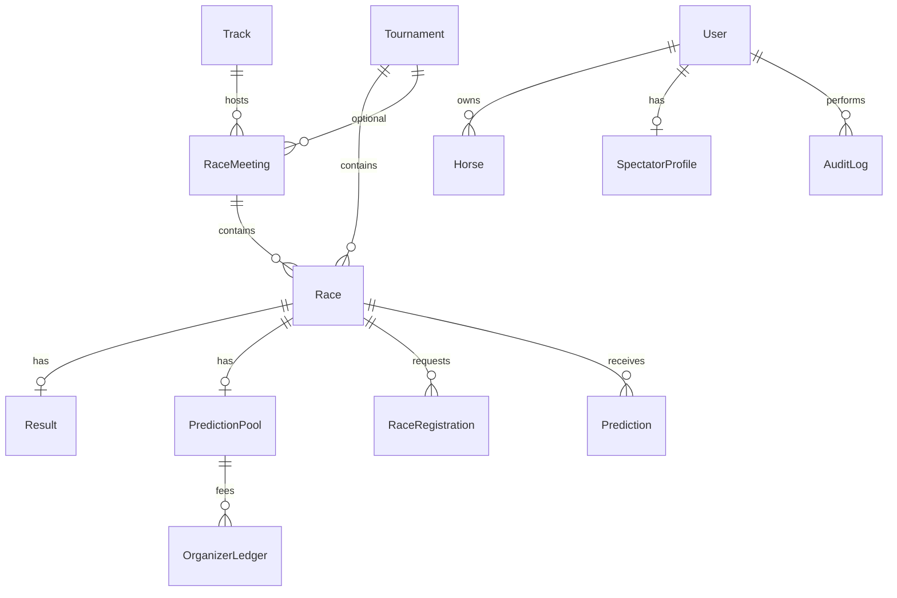

# DATABASE_EXPECT — Schema mục tiêu (production-ready)

> **Nguồn triển khai:** `backend/src/models/`  
> **Trạng thái:** Đã áp dụng vào Mongoose (optional fields — tương thích seed cũ).  
> **API / service:** triển khai sau theo từng sprint.

---

## 1. Tổng quan collections

| # | Collection | Model | Giai đoạn |
|---|------------|-------|-----------|
| 1 | users | User | Core |
| 2 | horses | Horse | Core |
| 3 | tracks | Track | **Mới** — sân đua |
| 4 | racemeetings | RaceMeeting | **Mới** — buổi đua (nhiều race) |
| 5 | tournaments | Tournament | Core |
| 6 | races | Race | Core + mở rộng |
| 7 | raceregistrations | RaceRegistration | Core |
| 8 | jockeyinvitations | JockeyInvitation | Core |
| 9 | results | Result | Core + mở rộng |
| 10 | predictions | Prediction | Core + pool fields |
| 11 | predictionpools | PredictionPool | **Mới** — quỹ dự đoán |
| 12 | spectatorprofiles | SpectatorProfile | Core |
| 13 | products | Product | Phase 2 |
| 14 | redemptions | Redemption | Phase 2 |
| 15 | notifications | Notification | Core |
| 16 | auditlogs | AuditLog | **Mới** — audit |
| 17 | organizerledgers | OrganizerLedger | **Mới** — phí quỹ / duy trì giải |

---

## 2. Sơ đồ quan hệ

---

## 3. Chi tiết theo model

### 3.1 User

| Field | Type | Ghi chú |
|-------|------|---------|
| email, passwordHash, role, fullName, phone, avatarUrl, isActive | — | Core |
| jockeyProfile.licenseNumber | string? | Chỉ role jockey |
| jockeyProfile.licenseExpiry | Date? | |
| jockeyProfile.isSuspended | boolean | default false |
| refereeProfile.certificationId | string? | role referee |

### 3.2 Horse

| Field | Type | Ghi chú |
|-------|------|---------|
| registrationId | string? | Số đăng ký / passport ngựa |
| sire, dam | string? | Phụ huynh |
| trainerName | string? | Huấn luyện (đơn giản) |
| *(còn lại)* | — | ownerId, breed, weight, healthStatus… |

### 3.3 Track (mới)

| Field | Type | Ghi chú |
|-------|------|---------|
| name | string | Bắt buộc |
| location | string | Tỉnh / địa chỉ |
| countryCode | string | default `VN` |
| surfaceDefault | turf \| synthetic \| dirt \| other | |
| isActive | boolean | |

### 3.4 RaceMeeting (mới)

| Field | Type | Ghi chú |
|-------|------|---------|
| tournamentId | ObjectId | |
| trackId | ObjectId | |
| meetingDate | Date | Ngày buổi đua |
| name | string | VD: "Buổi đua sáng 22/05" |
| status | scheduled \| ongoing \| completed \| cancelled | |

### 3.5 Tournament

| Field | Ghi chú |
|-------|---------|
| regulationsUrl | PDF quy chế giải |
| predictionConfig.poolEnabled | bounty pool |
| predictionConfig.entryFee, feePercent, rolloverPolicy | xem PREDICTION_POOL.md |

### 3.6 Race (mở rộng)

| Field | Ghi chú |
|-------|---------|
| meetingId, trackId | Liên kết buổi đua / sân |
| raceClass | string — hạng race |
| surface, going, weather | Điều kiện đường đua |
| streamUrl | Livestream |
| predictionOpenAt, predictionCloseAt | Override theo từng race |
| cancelReason, cancelledAt | Hủy race |

**Participant (embed):**

| Field | Ghi chú |
|-------|---------|
| clothNumber | Số áo (≠ lane) |
| carriedWeight | Cân mang (kg) — handicap |
| vetApprovedAt | Thú y duyệt |
| scratchedAt | Non-runner |
| confirmedAt | Owner xác nhận |

### 3.7 Result (mở rộng)

| Field | Ghi chú |
|-------|---------|
| isPhotoFinish | Photo finish |
| protests[] | Khiếu nại kết quả |
| rankings[].marginBehind | Khoảng cách (lengths hoặc giây) |
| rankings[].isDeadHeat | Đồng hạng |

### 3.8 PredictionPool (mới)

| Field | Ghi chú |
|-------|---------|
| raceId | unique |
| status | open \| locked \| settled |
| totalContributed, feePercent, feeCollected, netPool | |
| contributorCount, settledAt, rolloverIn | |

### 3.9 Prediction (mở rộng)

| Field | Ghi chú |
|-------|---------|
| contribution | Điểm góp quỹ |
| poolShare | Điểm nhận sau settle |
| scoringWeight | Trọng số chia pool |

### 3.10 AuditLog (mới)

| action | entity | actorId | metadata | createdAt |

### 3.11 OrganizerLedger (mới)

Ghi `feeCollected` theo tournament / race sau settle pool.

### 3.12 RaceRegistration (mở rộng)

| waiverAcceptedAt | Đồng ý quy chế |
| insuranceNote | Ghi chú bảo hiểm |

---

## 4. Quy tắc nghiệp vụ (expect)

| Rule | Enforce |
|------|---------|
| Participant sau jockey accept | ✅ hook |
| Active participant = không `scratchedAt` | ✅ utils |
| Race start ≥ 2 **active** participants | ✅ Race pre-save |
| Rankings chỉ từ active + không disqualify | ✅ result-rankings |
| Scratch trước `ongoing` | API (chưa) |
| Pool settle sau publish | API (chưa) |
| Audit mọi publish / approve | API → AuditLog |

---

## 5. Chưa implement (API layer)

- Auth JWT, routes, scoring service, pool settle  
- Email / SSE  
- Double-booking check (ngựa 2 race trùng giờ)  
- Auto chia `prizePool`  

---

## 6. Liên kết

- [DATABASE.md](./DATABASE.md) — hiện trạng ODM  
- [PREDICTION_POOL.md](./PREDICTION_POOL.md) — công thức bounty  
- [LOGIC_GAPS.md](./LOGIC_GAPS.md) — theo dõi hở còn lại  

---

*Cập nhật: áp dụng schema expect vào `backend/src/models/`.*
