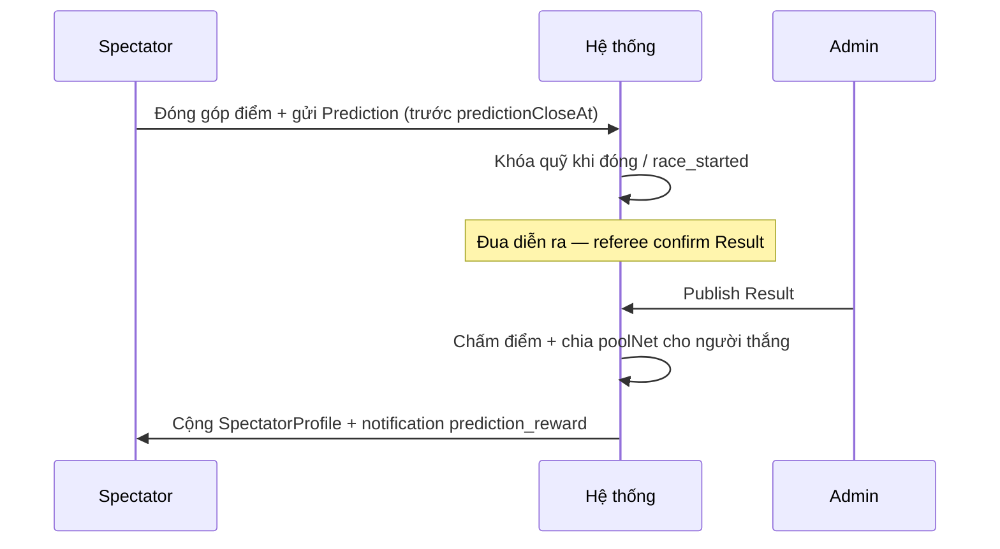

# Quỹ dự đoán (Prediction Pool / Bounty) — Thiết kế

> **Mục đích:** Mô phỏng học tập (search learning). **Không** phải cược tiền thật, không odds kiểu nhà cái.  
> **Trạng thái DB:** Phase 2 — **chưa** có trong Mongoose; implement khi làm API spectator pool.  
> **Tham chiếu UX công khai:** [Flashscore Đua ngựa](https://www.flashscore.vn/dua-ngua/) (kết quả / livescore — không copy cược).

---

## 1. Thuật ngữ (UI & báo cáo)

| Dùng | Không dùng |
|------|------------|
| Đóng góp vào quỹ, bounty, reward, điểm thưởng | Cược, stake, bet, odds, nhà cái |
| Quỹ dự đoán (prediction pool) | Pool cược |
| Phí duy trì giải | Commission cược |

**Disclaimer (footer / đăng ký):** *Hệ thống dùng điểm ảo nội bộ, không quy đổi tiền mặt, không phục vụ cá cược theo quy định pháp luật Việt Nam.*

---

## 2. Tách hai loại “quỹ”

| Quỹ | Field / entity hiện tại | Ai nhận |
|-----|-------------------------|---------|
| **Thưởng ngựa** (prize) | `Tournament.prizePool`, `Result.rankings[].prize` | Owner / ngựa thắng cuộc |
| **Quỹ dự đoán** (bounty) | *Phase 2:* `PredictionPool` | Spectator dự đoán đúng |

Hai quỹ **không trộn** số dư.

---

## 3. Mô hình đã chọn: gom pool + phí % (không fixed odds)

### 3.1 Luồng



### 3.2 Công thức

```
totalContributed = Σ Prediction.contribution   (theo raceId)
feeAmount        = totalContributed × (feePercent / 100)
poolNet          = totalContributed - feeAmount
```

Chia cho người thắng (ví dụ **theo điểm chính xác**):

```
score_i = (số hạng đoán đúng × pointsPerCorrect) + (bonus nếu đủ top 3 đúng)
poolShare_i = poolNet × (score_i / Σ score_j)   với mọi j là người có score_j > 0
```

Nếu **không ai có score > 0** → xem `rolloverPolicy` (mục 4).

**Phí duy trì** `feeAmount` ghi vào ledger tổ chức giải (admin / tournament), không trả lại spectator.

### 3.3 So với “đặt 1 ăn 3”

| | Pool + phí % | Fixed odds |
|---|--------------|------------|
| Phù hợp đồ án VN | ✅ | ⚠️ Dễ hiểu nhầm cược |
| Khớp code hiện tại | ✅ | Cần engine odds |
| Minh bạch phí giải | ✅ | Khó |

**Implied payout (tuỳ chọn UI):** hiển thị *ước tính* nếu chỉ mình bạn trúng — **không** cam kết tỉ lệ cố định.

---

## 4. Quy tắc nghiệp vụ

| # | Quy tắc |
|---|---------|
| 1 | Chỉ user `spectator`, `SpectatorProfile.currentBalance` ≥ `entryFee` |
| 2 | Một spectator / một race: tối đa `maxPredictionsPerRace` (đã có unique index) |
| 3 | Đóng góp chỉ trong `[predictionOpenAt, predictionCloseAt]` — khuyến nghị đóng **trước** `race_started` |
| 4 | Không sửa `predictedRanks` sau khi đóng quỹ |
| 5 | Chấm & chia pool **chỉ sau** `Result.publishedAt` |
| 6 | So sánh với `Result.rankings` (ngựa `disqualify` không có trong BXH) |
| 7 | `status`: `partial` nếu một phần hạng đúng; `correct` / `incorrect` theo ngưỡng team chọn |

### rolloverPolicy (chọn 1 khi code)

| Giá trị | Mô tả |
|---------|--------|
| `refund` | Hoàn `contribution` cho mọi người |
| `rollover_next_race` | Cộng `poolNet` sang `PredictionPool` race kế |
| `to_organizer` | Chuyển poolNet vào quỹ duy trì |

---

## 5. Schema hiện tại (Phase 1 — đã có)

```typescript
// Tournament.predictionConfig (embed)
{
  isEnabled: boolean;
  pointsPerCorrect: number;      // chấm cố định nếu chưa bật pool
  bonusPointsTop3: number;
  predictionOpenAt?: Date;
  predictionCloseAt?: Date;
  maxPredictionsPerRace: number;
}

// Prediction
{
  spectatorId, raceId, tournamentId,
  predictedRanks: [{ rank, horseId }],
  status: 'pending' | 'partial' | 'correct' | 'incorrect',
  pointsEarned, bonusPoints, totalPoints,
  evaluatedAt
}
```

Phase 1: admin publish result → service chấm **điểm cố định** từ config (không trừ balance lúc dự đoán).

---

## 6. Schema dự kiến (Phase 2 — khi implement)

### 6.1 Mở rộng `predictionConfig`

```typescript
interface IPredictionConfig {
  // ... giữ nguyên Phase 1
  poolEnabled?: boolean;           // default false
  entryFee?: number;               // điểm đóng góp tối thiểu / mỗi lần dự đoán
  feePercent?: number;             // 0–30, phí duy trì giải
  rolloverPolicy?: 'refund' | 'rollover_next_race' | 'to_organizer';
  minScoreToShare?: number;        // default 1 hạng đúng
}
```

*Tuỳ chọn:* copy `predictionOpenAt/CloseAt` xuống `Race` nếu một giải nhiều cuộc đua khác ngày.

### 6.2 Collection `PredictionPool` (khuyến nghị)

```typescript
interface IPredictionPool {
  raceId: ObjectId;              // unique
  tournamentId: ObjectId;
  status: 'open' | 'locked' | 'settled';
  totalContributed: number;
  feePercent: number;
  feeCollected: number;
  netPool: number;
  contributorCount: number;
  settledAt?: Date;
  rolloverIn?: number;           // điểm chuyển sang race sau
}
```

### 6.3 Mở rộng `Prediction`

```typescript
{
  contribution: number;          // điểm đã trừ khi tham gia
  poolShare?: number;             // điểm nhận sau chia pool
  scoringWeight?: number;        // score_i lúc settle
}
```

### 6.4 `PointsTxType` (shared.types)

Thêm:

- `spent_pool_entry` — trừ khi đóng góp
- `earned_pool_share` — nhận sau settle
- `pool_fee_to_organizer` — phí (ledger admin, optional)
- `refunded_pool` — hoàn khi rolloverPolicy = refund

### 6.5 Collection `OrganizerLedger` (tuỳ chọn)

Ghi `feeCollected` theo `tournamentId` để báo cáo “phí duy trì & phát triển”.

---

## 7. API dự kiến (gợi ý)

| Method | Path | Role |
|--------|------|------|
| GET | `/races/:id/pool` | public — tổng quỹ, trạng thái |
| POST | `/races/:id/predictions` | spectator — body: ranks + auto `entryFee` |
| POST | `/races/:id/pool/settle` | admin — sau publish, idempotent |
| GET | `/me/predictions` | spectator |

---

## 8. Checklist implement Phase 2

- [ ] Migration / default `poolEnabled: false`
- [ ] Service `prediction-scoring.service.ts` (partial / correct)
- [ ] Service `prediction-pool.service.ts` (lock, settle, rollover)
- [ ] Transaction 2 phase: trừ điểm + tạo Prediction
- [ ] Test: 0 người trúng, 1 người trúng, nhiều người trúng, tie score
- [ ] Cập nhật seed: scenario có & không có pool

---

## 9. Liên kết tài liệu

- [REQUIREMENTS.md](./REQUIREMENTS.md) — vai spectator, ma trận quyền
- [LOGIC_GAPS.md](./LOGIC_GAPS.md) — chỗ còn hở vs thực tế
- [DATABASE.md](./DATABASE.md) — ODM & enforce hiện tại
