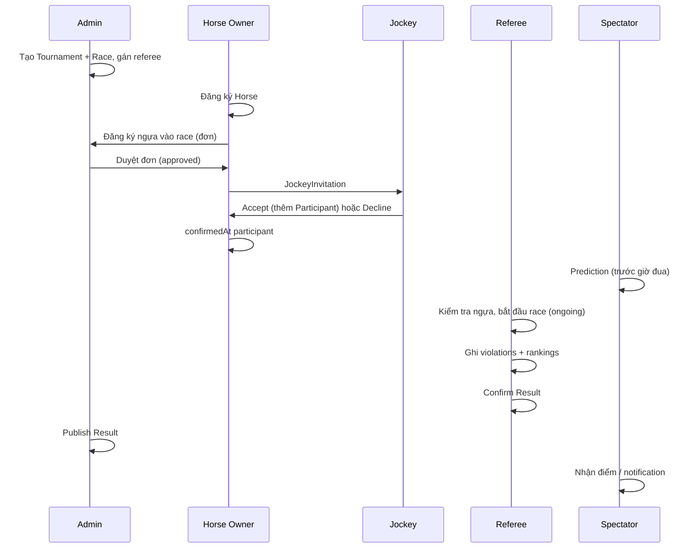

# Hệ thống quản lý giải đua ngựa — Tóm tắt yêu cầu

> Tài liệu chuẩn bị triển khai. Tham chiếu schema: `../database.txt` (Mongoose). Code hiện tại: API Express skeleton (`src/index.ts`).

---

## 1. Đánh giá nhanh: yêu cầu có phù hợp không?

**Có — bộ use case theo 5 role là hợp lý và khớp ~85% với thiết kế DB hiện có.**

| Đánh giá | Chi tiết |
|----------|----------|
| Phù hợp | Phân vai rõ (owner / jockey / referee / spectator / admin), luồng giải → cuộc đua → kết quả → dự đoán đã có entity tương ứng |
| Đã có model | **RaceRegistration** + duyệt admin; participant sau jockey accept (xem [LOGIC_GAPS.md](./LOGIC_GAPS.md)) |
| Giai đoạn sau | **Kết quả trực tiếp** (SSE/WebSocket); **quỹ dự đoán bounty** — [PREDICTION_POOL.md](./PREDICTION_POOL.md) |
| Ngoài phạm vi | Cược tiền / odds nhà cái; shop đổi quà (Product/Redemption phase 2) |

---

## 2. Vai trò & chức năng (theo yêu cầu)

### 2.1 Horse Owner (`horse_owner`)

| # | Chức năng | Ghi chú triển khai |
|---|-----------|-------------------|
| 1 | Đăng ký tài khoản | `User` + role `horse_owner`, bcrypt |
| 2 | Đăng ký ngựa tham gia giải đấu | `RaceRegistration` → admin duyệt → mời jockey → accept → vào `Race.participants` |
| 3 | Quản lý thông tin ngựa | CRUD `Horse` (ownerId = user hiện tại) |
| 4 | Thuê/chọn jockey cho ngựa | Tạo `JockeyInvitation` (horseId, raceId, jockeyId) |
| 5 | Quản lý danh sách jockey, xác nhận jockey tham gia cuộc đua | Lịch sử invitation; `Horse.currentJockeyId`; khi jockey accept → gắn participant |
| 6 | Xem lịch thi đấu ngựa, xác nhận ngựa tham gia | Query `Race` theo `participants.horseId`; set `participants[].confirmedAt` |
| 7 | Xem thông tin cuộc đua | Read `Race` + `Tournament` |
| 8 | Theo dõi kết quả, BXH, tiền thưởng ngựa | Read `Result.rankings` (filter horseId), field `prize` |

### 2.2 Jockey (`jockey`)

| # | Chức năng | Ghi chú triển khai |
|---|-----------|-------------------|
| 1 | Đăng ký tài khoản jockey | `User` + role `jockey` |
| 2 | Nhận lời mời từ horse owner | `Notification` type `invitation_received` + list `JockeyInvitation` |
| 3 | Xác nhận / từ chối | Update invitation `accepted` / `declined`; notify owner |
| 4 | Xem cuộc đua được phân công, thông tin ngựa | `Race.participants` where `jockeyId`; populate `Horse` |
| 5 | Theo dõi lịch thi đấu | Races theo jockeyId, status `scheduled` / `ongoing` |
| 6 | Kết quả cá nhân, BXH, thà tích | `Result.rankings` filter `jockeyId`; aggregate theo giải |

### 2.3 Race Referee (`referee`)

| # | Chức năng | Ghi chú triển khai |
|---|-----------|-------------------|
| 1 | Kiểm tra thông tin ngựa trước cuộc đua | Read `Horse` + participants của `Race` được gán (`Race.refereeId`) |
| 2 | Theo dõi cuộc đua | Đổi `Race.status` → `ongoing` (admin/referee); notify `race_started` |
| 3 | Ghi nhận & xử lý vi phạm | `Result.violations[]` (type, description, penalty) |
| 4 | Xác nhận kết quả | `Result.confirmedBy`, `confirmedAt`, `rankings` |
| 5 | Lập biên bản thi đấu | `Result.reportUrl` (file PDF/upload) hoặc export từ rankings + violations |

### 2.4 Spectator (`spectator`)

| # | Chức năng | Ghi chú triển khai |
|---|-----------|-------------------|
| 1 | Xem thông tin giải, lịch đua | Published `Tournament` + `Race` |
| 2 | Theo dõi kết quả trực tiếp, BXH | Đọc `Result` khi publish; **live**: SSE khi `race_started` / `result_published` |
| 3 | Dự đoán kết quả | `Prediction` + `predictionConfig`; phase 2: đóng góp quỹ — [PREDICTION_POOL.md](./PREDICTION_POOL.md) |
| 4 | Theo dõi kết quả dự đoán | `Prediction.status` (`partial`/`correct`/…), `pointsEarned`, `evaluatedAt` |
| 5 | Nhận thông báo thưởng | `prediction_reward`; cộng `SpectatorProfile` (điểm ảo, không cược tiền) |

### 2.5 Admin (`admin`)

| # | Chức năng | Ghi chú triển khai |
|---|-----------|-------------------|
| 1 | Quản lý tài khoản | CRUD `User`, `isActive` |
| 2 | Phân quyền role | Sửa `User.role` (enum 5 role) |
| 3 | Quản lý giải, lịch, vòng đua | CRUD `Tournament`, `Race` (round, scheduledAt, maxParticipants) |
| 4 | Duyệt đăng ký tham gia | `RaceRegistration` approve/reject (không auto participant) |
| 5 | Quản lý danh sách ngựa, jockey | List toàn hệ thống `Horse`, `User` role jockey |
| 6 | Phân công trọng tài | `Race.refereeId` |
| 7 | Công bố kết quả | `Result.publishedBy`, `publishedAt` (sau khi referee confirm) |
| 8 | Quản lý dự đoán | Cấu hình `predictionConfig`; trigger chấm `Prediction` sau publish |

---

## 3. Luồng nghiệp vụ chính



---

## 4. Ánh xạ yêu cầu ↔ Database (`database.txt`)

| Entity | Vai trò liên quan |
|--------|-------------------|
| `User` | Tất cả — auth, role |
| `Horse` | Owner, Admin, Referee (kiểm tra) |
| `Tournament` | Admin, Spectator |
| `Race` | Admin, Owner, Jockey, Referee |
| `Race.participants` | Owner confirm, Jockey assign |
| `JockeyInvitation` | Owner ↔ Jockey |
| `Result` | Referee (confirm), Admin (publish), tất cả (xem) |
| `Prediction` | Spectator, Admin (chấm) |
| `SpectatorProfile` | Spectator (điểm) |
| `Notification` | Mọi sự kiện quan trọng |
| `Product` / `Redemption` | Phase 2 (đổi quà) — không trong list yêu cầu hiện tại |

---

## 5. Quyết định & thiết kế bổ sung

### 5.1 Đăng ký ngựa — **đã có** `RaceRegistration`

- Owner gửi đơn → `pending`
- Admin duyệt → `approved` (không tự thêm `participants`)
- Owner mời jockey → `accepted` → hook thêm `Race.participants`
- Từ chối đơn → `rejected`

### 5.2 Quỹ dự đoán (bounty) — **chưa code DB**

- Gom điểm ảo, trừ % phí duy trì giải, chia cho người dự đoán đúng sau publish.
- Chi tiết: **[PREDICTION_POOL.md](./PREDICTION_POOL.md)**  
- Không dùng từ cược / odds; không tiền thật.

### 5.3 “Kết quả trực tiếp” (Spectator)

| Mức | Mô tả |
|-----|--------|
| MVP | Poll/refresh `Result` + `Race.status`; notification khi publish |
| Nâng cao | SSE/WebSocket; tuỳ chọn `Race.streamUrl` (YouTube/HLS) |

### 5.4 Ai được đổi trạng thái Race?

| Hành động | Đề xuất |
|-----------|---------|
| `scheduled` → `ongoing` | Referee (race được gán) hoặc Admin |
| `ongoing` → `completed` | Referee |
| Publish result | Admin (sau confirm referee) |

### 5.5 Quy tắc dự đoán

- Mở/đóng: `Tournament.predictionConfig.predictionOpenAt` / `predictionCloseAt` (sau này có thể theo từng `Race`)
- Đóng trước `race_started` (khuyến nghị)
- Chấm điểm: sau `Result.publishedAt`, so sánh `predictedRanks` với `Result.rankings` (ngựa disqualify không tính)
- Phase 2 pool: [PREDICTION_POOL.md](./PREDICTION_POOL.md)

### 5.6 Chỗ còn hở / khác thực tế

- Bảng đầy đủ: **[LOGIC_GAPS.md](./LOGIC_GAPS.md)**

---

## 6. Ma trận phân quyền (tóm tắt API)

| Tài nguyên | Owner | Jockey | Referee | Spectator | Admin |
|------------|:-----:|:------:|:-------:|:---------:|:-----:|
| User (self) | RU | RU | RU | RU | CRUD all |
| Horse (own) | CRUD | R | R | — | R |
| Tournament | R | R | R | R | CRUD |
| Race | R + confirm | R | RU status* | R | CRUD |
| JockeyInvitation | CR | RU accept | — | — | R |
| RaceRegistration | C R | — | — | — | RU approve |
| Result | R | R | CRU confirm | R | RU publish |
| Prediction | — | — | — | CR (own) | R manage |
| Notification | R (own) | R | R | R | R |

\* Referee chỉ race có `refereeId` = mình.

---

## 7. Lộ trình triển khai đề xuất

| Phase | Nội dung | Deliverable |
|-------|----------|-------------|
| **0** | Setup MongoDB, models từ `database.txt`, auth JWT | Login/register theo role |
| **1** | Admin: Tournament, Race, assign referee | Lịch giải |
| **2** | Owner: Horse CRUD, RaceRegistration, Invitation | Đăng ký + mời jockey |
| **3** | Jockey: accept/decline, lịch đua | Luồng invitation hoàn chỉnh |
| **4** | Referee: violations, confirm result, biên bản | Result draft |
| **5** | Admin: publish result | Kết quả công khai |
| **6** | Spectator: prediction, chấm điểm, notification | Gamification (điểm cố định) |
| **6b** | Prediction pool / bounty | [PREDICTION_POOL.md](./PREDICTION_POOL.md) |
| **7** | Live/SSE (tuỳ chọn) | Trải nghiệm “trực tiếp” |

---

## 8. Cấu trúc repo

Đã scaffold — chi tiết: [PROJECT_STRUCTURE.md](./PROJECT_STRUCTURE.md)

```
Horse_race/
├── backend/                 ← API Express + TS
├── frontend/                ← React + Vite + TS
├── docs/
├── database.txt
└── README.md
```

---

## 9. Checklist trước khi bắt đầu code

- [x] `RaceRegistration` + duyệt admin; participant sau jockey accept
- [x] Race state: scheduled → ongoing → completed (referee/admin API sau)
- [ ] Spectator live: MVP refresh hay WebSocket
- [ ] Product/Redemption trong đồ án? (phase 2)
- [ ] Prediction pool / bounty — [PREDICTION_POOL.md](./PREDICTION_POOL.md) phase 2
- [x] Models `backend/src/models/`; [LOGIC_GAPS.md](./LOGIC_GAPS.md) theo dõi hở

---

*Tạo: chuẩn bị sprint 1 — Horse Racing WDP.*
